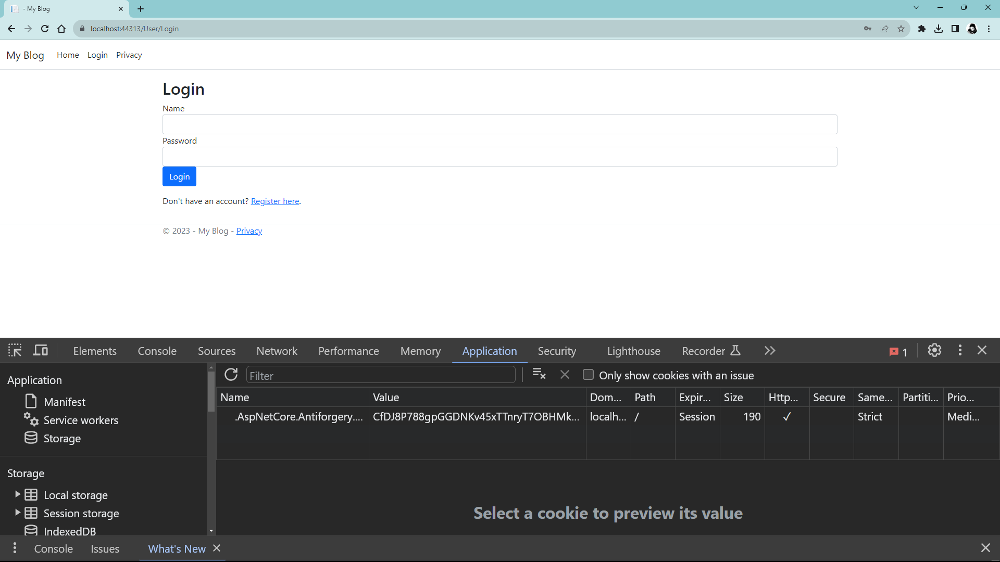
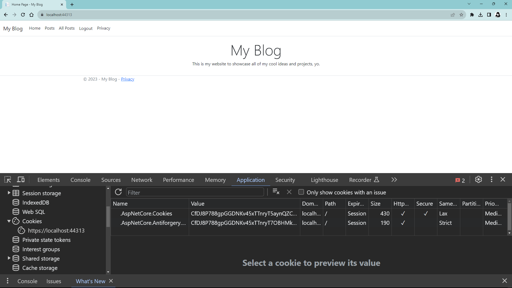
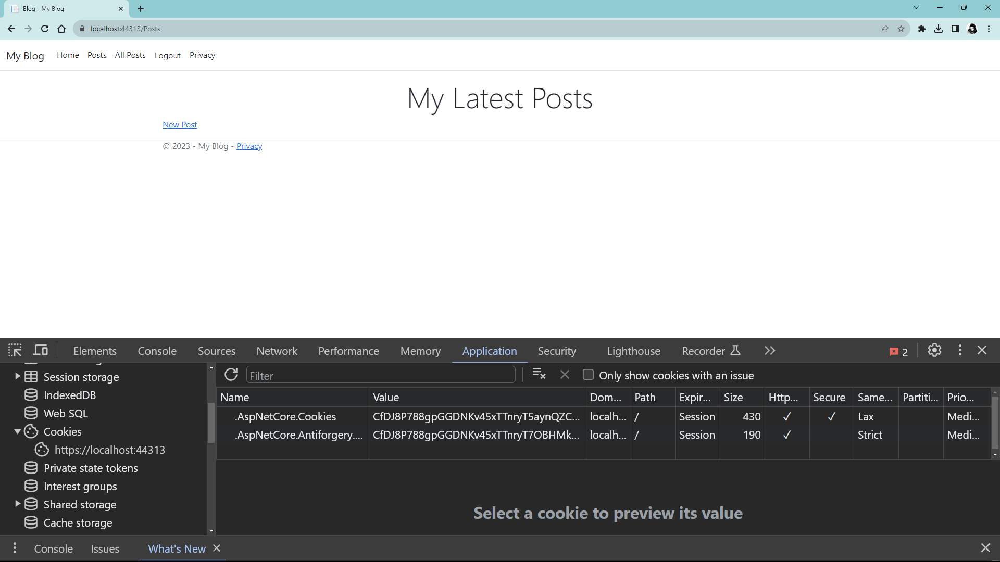
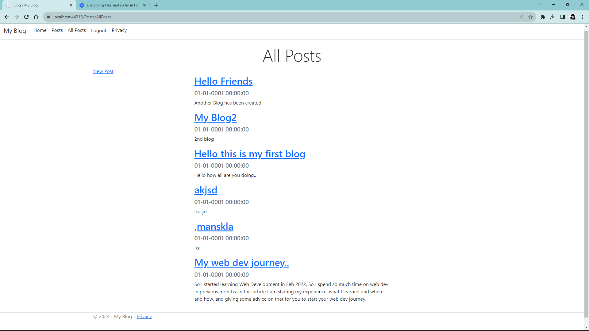
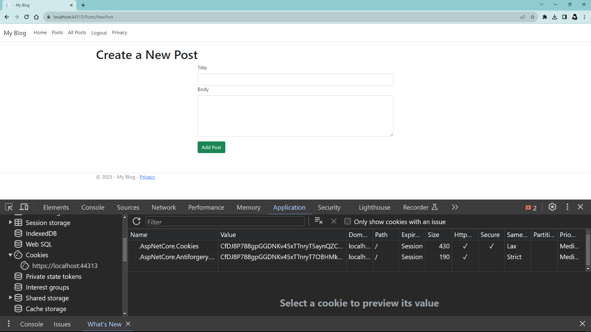
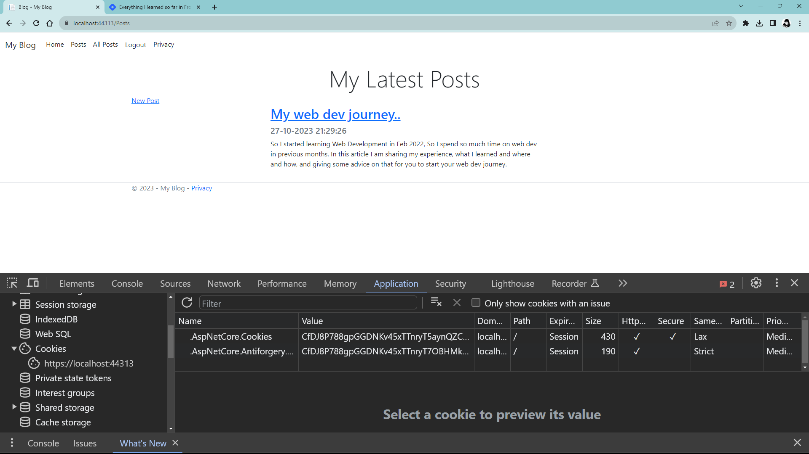
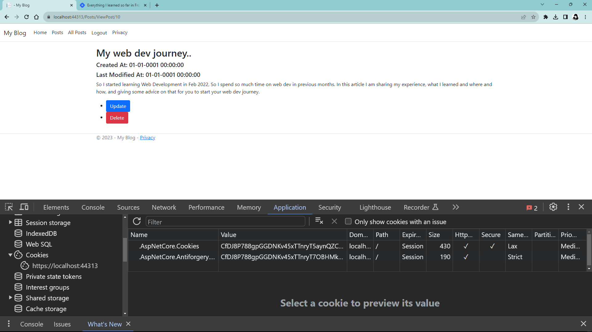
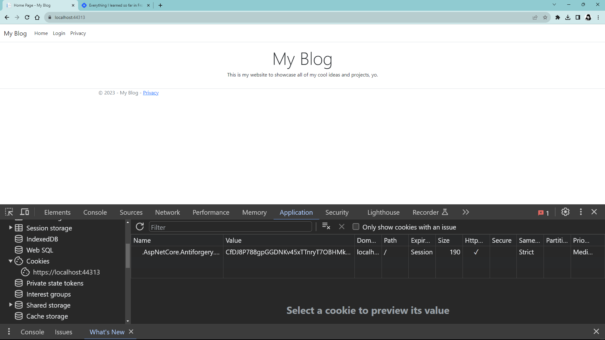
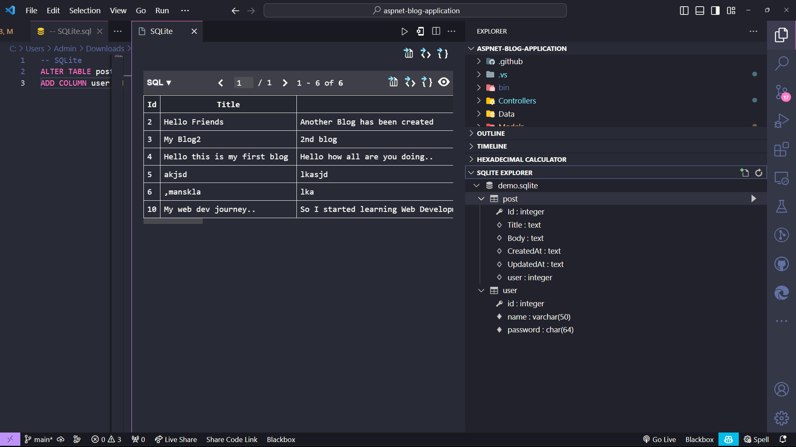

# My Blog

## How to run?

> For running the project just download the zip file and open it in the VS code and run the project on ISS server. We have used the sqlite so you don't have to configure anything

## ScreenShots

### Login Page

### Home Page

### Cookie

### All posts

### Add Post

### My Posts

### Update and delete post

### Logout

### Database

